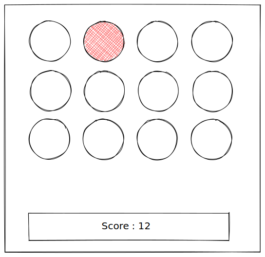

# Whack-A-Mole

Let's create a simple Whack-A-Mole clone.
The goal of this traditional game is to prevent "moles" from coming out the ground with a hammer. Every second a new "mole" appears and you'll have to click on it to gently tell her to go back into the soil where it belongs. Everytime you click on a mole, your score increases.

## Layout

## Features

- Display Score
- Start / Pause Button
- Reset Score Button
- Hard Mode (  Random delay time between the mole apparition)

## Screenshot

